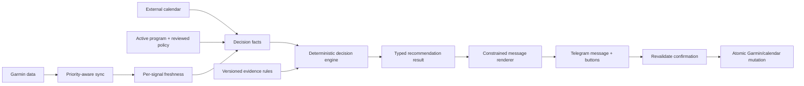
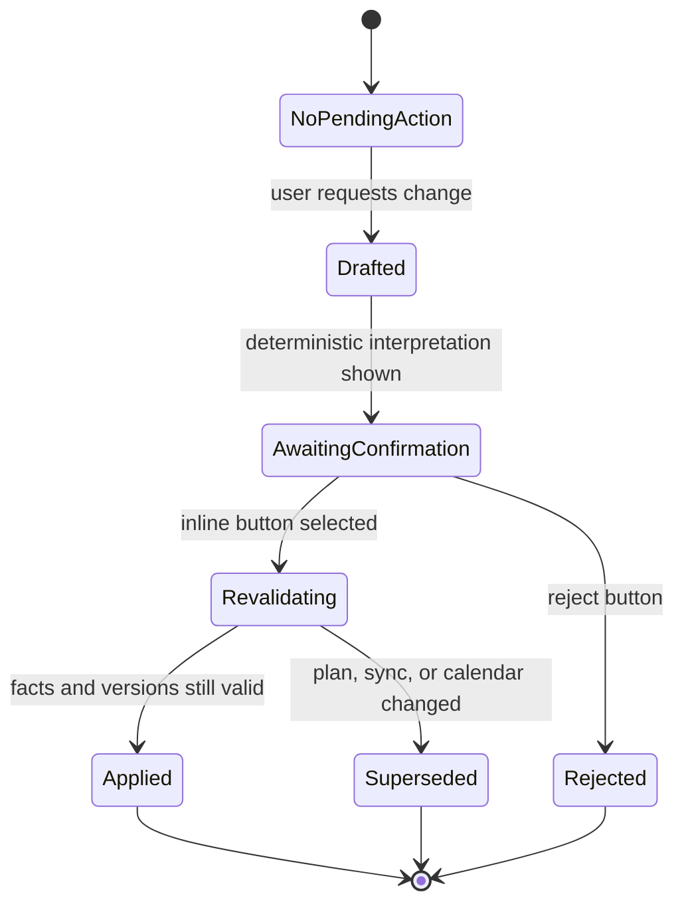

# Garmin Coach Telegram Bot: Product and System Architecture

Status: implemented product and architecture baseline

Date: 2026-07-18

Scope: single-user deployment; Telegram coaching, Garmin sync, metrics, notifications, and program sequencing

This document records the product contract and the architecture implemented in
the repository. Where evidence or a product decision remains incomplete, the
runtime blocks automation instead of inventing a rule.

## 1. Product contract

The bot is a cold, concise AI assistant. It is not a simulated human coach. Its
job is to state what the data supports, explain the decisive reason, and ask for
confirmation before a consequential change.

The product has five non-negotiable constraints:

1. Personalized recommendations use synced facts, the active program, its
   source-reviewed operating rules, and explicitly reviewed scientific rules.
2. The language model does not decide workout eligibility, readiness actions,
   scheduling mutations, or metric meaning. It renders a deterministic result
   and answers non-mutating questions from supplied facts and sources.
3. Readiness metrics never silently change sets, repetitions, weights, or the
   exercise list. The original session remains intact.
4. The athlete retains final authority. A metric-based warning or skip
   recommendation can be overridden with an explicit button confirmation.
5. The bot never asks the athlete to type completed weights, repetitions, or
   sets. Those are obtained from Garmin sync. There are no proactive
   post-workout questions.

### Out of scope

- Medical diagnosis, emergency detection, or claims that a wearable can
  determine injury risk.
- Prescriptive use of ACWR. ACWR remains a UI-only descriptive metric.
- A custom composite readiness number.
- Multi-user preparation in this phase.
- Metric-driven alternate versions of a strength session.
- Uploading optional recovery activities to Garmin.

## 2. Authority boundaries

The system separates facts, rules, decisions, language, and mutations.

| Layer | May do | Must not do |
| --- | --- | --- |
| Sync | Fetch and persist raw Garmin observations and provenance | Interpret physiology |
| Freshness | Classify each required signal as fresh, pending, missing, stale, or unsupported | Treat a missing observation as device non-support |
| Program engine | Resolve active program, next sequence session, rest slots, and completion | Reset at week boundaries or count an unrelated activity |
| Evidence engine | Produce a bounded recommendation from approved rules | Create a new physiological rule from prose or model output |
| Language model | Express the supplied result briefly; answer sourced informational questions | Change the result, invent facts, or emit executable actions |
| Action service | Stage, revalidate, and apply a confirmed mutation | Execute an old or ambiguous confirmation |

## 3. Deterministic recommendation model

Every coaching run produces a typed `DecisionResult`, even if nothing is sent.
The result is retained with the input facts, rule versions, and freshness state
that produced it.

### Required output fields

- `decision_id` and `evaluated_at`
- `decision_type`
- `active_program_id` and `program_policy_version`
- `planned_session_id`, when applicable
- `next_program_session_id` and earliest eligible date
- decisive observations with value, source, observation time, and freshness
- missing observations classified as critical or non-critical
- applied evidence rule identifiers and citations
- user-visible reason codes
- permitted buttons/actions
- a stable idempotency key for notification delivery

### Decision types

| Type | Meaning |
| --- | --- |
| `WAITING_FOR_DATA` | Critical data is expected and a fetch or watch sync may complete it |
| `SYNC_REQUIRED` | Critical data is still absent at the deadline and the watch must sync |
| `KEEP_PLANNED_SESSION` | Today's existing session remains the plan |
| `PROPOSE_NEXT_SESSION` | No session is planned and the next program session is eligible today |
| `PROGRAM_REST_DAY` | Program spacing prevents the next strength session today |
| `WARN_ORIGINAL_SESSION` | Session stays unchanged; a reviewed metric rule warrants a warning |
| `ADVISE_SKIP_SESSION` | A reviewed rule supports skipping; the athlete may override |
| `BEST_EFFORT` | A decision was possible without a non-critical observation |
| `NO_ACTION` | There is no useful proactive message for this event |

### Evaluation order

The order is deliberate. Biometrics do not override the identity or spacing of
the selected program.

1. Resolve the one active program and its versioned policy.
2. Reconcile synced activities against planned and program sessions.
3. Resolve today's planned session or the next eligible sequence session.
4. Apply source-program rest slots. A missed session remains the next session;
   it is not debt and the sequence never resets on Monday.
5. Evaluate per-signal freshness and device capability.
6. Apply the Garmin Training Readiness rule when supported and fresh.
7. If Training Readiness is unsupported, apply only independently approved
   individual-signal rules. Never synthesize a score.
8. Check calendar feasibility when a time or existing plan is involved.
9. Add a source-eligible, evidence-reviewed optional recovery activity on a
   program rest day.
10. Produce permitted actions. The renderer cannot add more.

## 4. Biometric policy

### Garmin Training Readiness capability

Capability is tri-state: `supported`, `unsupported`, or `unknown`.

- `supported` is established by a previously received Training Readiness
  observation or authoritative device capability metadata.
- `unsupported` requires authoritative capability metadata or an explicit
  administrator override.
- A null endpoint response, one missing day, or a failed sync can never change
  capability to `unsupported`.
- `unknown` follows the conservative supported-device missing-data path until
  capability is resolved. It never activates a fallback score.

### Supported-device rules

Garmin's numeric score and official category are displayed together:

| Garmin score | Category | Workout consequence |
| --- | --- | --- |
| 95-100 | Prime | No readiness warning |
| 75-94 | High | No readiness warning |
| 50-74 | Moderate | No readiness warning |
| 25-49 | Low | Keep the original workout; add one concise warning |
| 1-24 | Poor | Advise skipping; offer an explicit option to perform the original workout |

Training Readiness is supporting evidence, not a performance prediction. It
does not reduce weights or generate a lighter session.

When the device supports Training Readiness but today's value is missing:

- never use a custom or historical substitute;
- never infer that the athlete is ready;
- apply no Training Readiness adjustment;
- use the remaining fresh facts only after the missing-data flow is resolved;
- state that Training Readiness was unavailable.

### Unsupported-device rules

The system reasons from individual observations such as sleep duration, Garmin
Sleep Score/category, Garmin HRV status or baseline range, resting heart rate,
and stress. It does not combine them into a single number.

An individual observation can change a workout recommendation only when a
versioned evidence rule defines:

- the eligible population and activity type;
- the exact input and minimum history;
- acceptable freshness and missing-data behavior;
- a bounded conclusion;
- an authoritative citation and review date;
- deterministic fixtures covering boundary and contradictory-signal cases.

Until such a rule is reviewed, the observation may be described but has no
prescriptive authority. Version 1 therefore has no unsupported-device
metric-only skip rule by default.

### Standard morning metric line

- Show Garmin Training Readiness score and category when available.
- Show total sleep duration and Garmin Sleep Score/category.
- Hide HRV, resting heart rate, and stress when they do not affect the result.
- When one affects the result, express it relative to the athlete's own valid
  baseline or Garmin status, not as an unexplained raw number.
- Do not include sleep-stage duration unless the athlete explicitly asks.
- Never use ACWR in Telegram decisions, warnings, or summaries.

Age, sex, and other demographics may be used only when the applied rule
explicitly models them. Generic statements such as “older users recover more
slowly” are prohibited.

## 5. Morning briefing

The morning briefing is the daily source of truth.

### Trigger and deadline

- Start checking after the configured morning watch window opens.
- Send immediately when the required overnight facts are fresh.
- 11:30 local time is the latest data-wait deadline.
- Produce at most one authoritative morning briefing per local date. A later
  material correction is a separate update linked to the original decision.
- Before 11:30, the absence of an active approved program is treated as a
  temporary unavailable plan state, not as an authoritative `NO_ACTION`
  decision. Program activation resumes evaluation immediately.
- If an older or test-generated `NO_ACTION` briefing already exists and the
  active program later becomes available, send one clearly labelled morning
  briefing update with the current workout/rest decision.

### Critical missing data

Before 11:30, an expected server-side observation triggers a priority fetch.
The bot may send: “Overnight data is available on Garmin. Fetching it now. The
briefing will follow automatically.” It sends the result when the fetch ends.

At 11:30, stop waiting and automatically evaluate with the remaining fresh
facts. Send one clearly labeled best-effort workout/rest briefing and name each
omitted critical observation. Later data creates a separate update only when it
materially changes the decision. A temporary Garmin error is not described as
a missed watch sync.

Non-critical missing data never blocks the briefing. The result states the
omission in one short clause.

### Workout-day outcomes

- If a workout is already planned, name it and its start time.
- If no workout is planned and the next program session is eligible, propose
  that exact session.
- Low Training Readiness adds a warning without modifying the session.
- Poor Training Readiness recommends rest without advancing the program. If a
  workout is already scheduled, show `Keep workout`, `Cancel workout`, and
  `Set another date`.
- A program rest day is not overridden by favorable metrics. The bot explains
  the spacing rule in one line.

### Optional recovery activity

On a program rest day, the briefing proactively adds one optional recovery
activity only when:

1. the selected source program explicitly includes or permits that activity;
2. the catalog policy marks it `evidence_reviewed`;
3. it does not violate the next session's recovery slot; and
4. its wording makes no unsupported promise of faster recovery.

The activity is verbal guidance only. It creates no Garmin workout, calendar
event, approval action, completion expectation, or program-sequence change.
The default eligible suggestion is easy walking or another explicitly reviewed
low-fatigue modality at conversational effort. Active recovery evidence is
mixed and often low certainty, so the bot may say it is optional light movement;
it must not claim that it reliably restores performance or prevents injury.

Example:

> Program rest day: Day 2 is next, earliest tomorrow. Optional: 20-30 minutes
> of easy walking. Keep it conversational; this is light movement, not a
> replacement workout.

## 6. Other notifications

### Evening

The bot never creates or uploads tomorrow's workout before the next night's
sleep and morning readiness data. After 17:00 it may send only a logistical or
unresolved-decision message where silence would cost the athlete something.

### Pre-workout reminder

- Deliver exactly one hour before the confirmed start.
- Message contains only workout name and start time.
- Recheck the planned-session status and calendar immediately before sending.
- Persist the reminder so an application restart cannot lose it.

### Weekly summary

- Deliver Saturday at 20:00 local time.
- Include completed versus expected program sessions, meaningful synced
  strength progression, recovery trend, unmatched or missed sessions without
  judgment, unresolved confirmed issues, and the next sequence state.
- If nothing changed, send one factual line.
- Do not use ACWR, motivational language, emojis, or an LLM-generated training
  conclusion.

### Calendar conflicts

Check conflicts:

1. while producing the morning briefing;
2. immediately before approving, replacing, or rescheduling a workout; and
3. immediately before the pre-workout reminder.

An alert offers `Keep workout`, `Set another date`, and `Cancel workout`. No
continuous calendar polling is required.

### Metric anomalies and quiet hours

Quiet hours are 22:00-07:00 local. Suppressed events are queued and revalidated
before delivery. Overnight biometric changes normally wait for the morning.

A daytime biometric update is proactive only when new, fresh data materially
invalidates an existing same-day workout decision. Example: a late Garmin
Training Readiness value becomes Poor before a confirmed workout. A single HRV,
Body Battery, or sleep-stage outlier is not a severe alert, and the bot does not
present wearable anomalies as medical emergencies.

## 7. Program policy and sequence

Every catalog template needs a machine-readable `ProgramPolicy` stored with a
policy version and source review date. It contains:

- immutable program key and source URL;
- ordered session keys and identity fingerprints;
- source duration as metadata, not an automatic stop condition;
- rolling rest slots after each session;
- whether consecutive training days are allowed or merely tolerated;
- progression and substitution rules that the current product actually
  supports;
- optional recovery activities with source and evidence status;
- excluded source components and an accurate adaptation label;
- evidence citations and reviewer date.

Weekday names from source pages are examples of spacing and order, not fixed
calendar requirements. The program cursor persists across week boundaries.

### Completion reconciliation

The program cursor advances only from a confidently matched completed activity:

1. Exact provenance: the activity is linked to the Garmin workout generated for
   the planned program session.
2. Manual equivalent: it is the next eligible session in the one active program
   and its normalized exercise fingerprint uniquely identifies that session.

Manual equivalence uses unique identity anchors compiled from the active
program's session definitions. It does not compare against other programs and
does not rely on the activity title alone. Ambiguous activities remain
unmatched; the cursor does not advance.

The reconciliation result updates the `PlannedSession` status and records the
matched `Activity` identifier and match method. Missing sessions do not cause a
reset or catch-up schedule.

## 8. Two-way Telegram state

Free text may initiate a change, but it never directly mutates Garmin or the
calendar.

A pending interaction stores its type, exact target, proposed payload, source
decision, program and calendar versions, creation time, expiry, and status.
Generic “yes” is never mapped to the latest chat message.

At button click, the server reloads the active program, sync state, planned
session, and calendar. If any decisive fact changed, the old action is refused
and a fresh proposal is generated. Applying a confirmed replacement is atomic:
the original remains intact if creation or scheduling of the replacement fails.

Voluntary free-text reports such as pain, dizziness, or unusual difficulty are
restated and require an inline confirmation before being persisted or used in a
future recommendation. Confirmed safety symptoms can block an action through a
separate safety policy; they are not converted into biometric scores.

An active confirmed safety report blocks workout-time suggestions and schedule
or reschedule proposals. The athlete may explicitly close the report through a
separate confirmation, which restores planning but never represents medical
clearance.

Informational Telegram queries may show the rolling plan state (last completed,
next session, earliest recommended date, and a current scheduled session),
recorded lift evidence against the next session's configured targets, or an
informational 30-minute abbreviated session. Lift history never changes target
weights automatically. An abbreviated session is never scheduled or pushed to
the watch without a separate athlete-approved workflow.

## 9. Sync architecture

The current monolithic sync must become a priority-aware orchestration while
preserving one shared run lock.

### Priority morning sync

Fetch only the observations required to evaluate the morning:

1. device upload metadata and authentication status;
2. last night's sleep duration and Sleep Score;
3. today's Garmin Training Readiness when capability is supported or unknown;
4. required individual health observations for unsupported devices;
5. today's planned session and active program cursor from local data.

As soon as these are committed, emit `OVERNIGHT_FACTS_UPDATED` and evaluate the
briefing. Activity history, workout-template reconciliation, multi-day
backfills, and dashboard snapshots continue in the background.

### Freshness model

Freshness is recorded per signal, not as one global “sync complete” boolean.

| State | Meaning |
| --- | --- |
| `fresh` | Observation covers the required local date and was fetched after the relevant device upload |
| `expected_pending` | Garmin indicates newer device data or an active fetch may provide it |
| `missing` | Supported/expected observation is absent after a successful relevant fetch |
| `stale` | An older observation exists but cannot represent the decision date |
| `unsupported` | Authoritative device capability says the metric is unavailable |
| `error` | Authentication, endpoint, or parsing failed; not equivalent to missing |

Every observation used in a decision carries `observed_for`, `fetched_at`,
`source_endpoint`, and freshness. This prevents a successful activity fetch
from falsely making sleep or readiness “fresh.”

### Sync failures requiring action

- Missing required overnight data at 11:30 after a successful relevant fetch.
- Expired authentication, MFA, or reconnect requirement.
- Calendar access failure when a scheduling decision requires the calendar.

Transient timeouts and rate limits retry silently unless they block the 11:30
flow. User-facing text distinguishes watch-not-synced, Garmin data pending,
authentication failure, and server fetch failure.

## 10. Implemented data and state model

The implementation persists the following concepts for traceability and
restart-safe behavior. `ProgramPolicy` is a versioned code catalog; the other
stateful concepts are stored in SQLite.

| Concept | Required fields |
| --- | --- |
| `DeviceCapability` | metric, tri-state support, evidence source, first/last observed, override |
| `ObservationFreshness` | signal/date, state, observed-for, fetched-at, endpoint, error code |
| `ProgramPolicy` | program key/version, source review, sequence/rest rules, recovery policy, exclusions |
| `ProgramCursor` | active program, next session, last matched activity, policy version |
| `ActivityProgramMatch` | activity, program session, method, confidence class, matched-at |
| `DecisionRecord` | typed result, fact snapshot, rules, permitted actions, idempotency key |
| `PendingInteraction` | exact action, target/version hashes, expiry, status |
| `NotificationOutbox` | event type, due time, quiet-hour policy, status, attempts, idempotency key |
| `MorningBriefState` | decision day, fetch/deadline state, prompt status, answer-anyway choice |

`DailyHealth.training_readiness` is the raw Garmin score and remains separate
from `DailyMetrics.readiness`. The custom composite `DailyMetrics.readiness`
is retired from both coaching and user-facing UI; recomputation writes `NULL`
and the column remains only for schema compatibility. The UI shows Garmin Training
Readiness on supported devices and individual observations on unsupported
devices. ACWR stays available only to the UI.

## 11. Current implementation map

| Area | Implemented behavior | Known limit |
| --- | --- | --- |
| `sync/sync_service.py` | Briefing-critical overnight signals are committed first; background sync continues afterward | Garmin endpoint behavior and authentication still depend on the unofficial client |
| `metrics/freshness.py` | Per-signal freshness and capability-aware requirements distinguish pending, missing, stale, error, and unsupported states | Unsupported-device individual-metric decision rules remain intentionally unapproved |
| `metrics/engine.py` | Computes scale-consistent TRIMP, EWMA ACWR, sleep debt, and descriptive strength metrics; custom readiness is `NULL` | ACWR has UI authority only |
| `coach/snapshot.py` and `coach/decision_engine.py` | Build typed facts with Garmin readiness, provenance, program state, calendar state, and persisted rule results | A missing supported-device readiness value is omitted, never imputed |
| `coach/renderer.py` and `coach/interactions.py` | Render typed outcomes, stage exact actions, and revalidate every confirmation | Optional LLM free-text answers remain informational only |
| `coach/programs.py` and `coach/program_policy.py` | Ten source-audited templates include sequence, recovery intervals, exclusions, warm-ups, and rest timers | Source duration, deload, and progression rules are metadata only |
| `coach/program_state.py` | Reconciles generated-workout provenance or guarded unique fingerprints and advances a rolling cursor | Ambiguous or unrelated activities deliberately do not advance the program |
| `coach/garmin_compiler.py` | Compiles structured strength steps with sets, reps/duration, weight, warm-up, and rest | Superset groups and a separate between-exercise transition timer are not represented |
| `notify/outbox.py` and `notify/weekly.py` | Persist notifications, apply quiet hours and revalidation, and generate a deterministic Saturday summary | Delivery still requires a configured Telegram bot/webhook |
| `sync/scheduler.py` | Runs configurable syncs, priority morning polling, the 11:30 deadline, Saturday 20:00 summary, and outbox draining | Scheduler runs in-process with the web application |
| Telegram webhook | Accepts informational free text and versioned callbacks; stale actions cannot mutate state | Generic text confirmation is never treated as approval |

## 12. Evidence governance

Source-program instructions and scientific evidence answer different questions:

- The program source defines the identity and intended dosage of that program.
- Independent evidence determines whether the bot may make a physiological or
  recovery claim about that instruction.

Every prescriptive rule has a registry entry containing citation, population,
inputs, output, exclusions, evidence grade, reviewer, review date, and expiry or
re-review date. Observational associations cannot be promoted to causal injury
or performance claims.

Key baseline conclusions for this design:

- Garmin documents the Training Readiness inputs and official categories, and
  explicitly states that the metric is not intended to predict performance.
- ACWR does not have adequate causal support for prescriptive injury-prevention
  advice; it has no bot authority.
- Consumer sleep stages are too uncertain for routine prescriptive use; total
  sleep and Garmin's aggregate Sleep Score are the standard briefing facts.
- Active recovery may reduce perceived soreness in some studies, but evidence
  quality and performance effects are inconsistent. Suggestions remain
  optional, low-fatigue, and free of guaranteed recovery claims.
- Subjective session RPE can be useful, but the product collects it only when
  Garmin sync provides it. The bot does not prompt for it after a workout.

## 13. Implemented sequence and acceptance gates

### Increment 1: program truth and reconciliation

Status: implemented 2026-07-18.

- Add policies for all nine catalog programs.
- Keep the removed, source-incomplete Get RIPPED adaptation unavailable.
- Add persistent program cursor and completion matching.
- Demonstrate no weekly reset and no cross-program match.

Gate: synthetic histories advance only the correct active program session;
ambiguous and unrelated activities do not advance it.

Implementation notes: source policies are validated against the catalog at
load time; the rolling cursor is created on activation and persisted in the
database; planned Garmin sessions reconcile through workout-id provenance;
manual equivalents require every configured exercise and a unique fingerprint
inside the active program. Explicit provenance for any other workout blocks the
manual-fingerprint fallback. Completion records preserve the activity, method,
and policy version used.

### Increment 2: observation freshness and priority sync

Status: implemented 2026-07-18.

- Add capability state and per-signal freshness.
- Split priority overnight fetch from background sync.
- Add the 11:30 pending/manual-sync/answer-anyway flow.

Gate: delayed uploads, endpoint errors, unsupported devices, and app restarts
produce distinct deterministic states without a fallback readiness score.

Implementation notes: `DeviceCapability` never infers unsupported status from
absence; `ObservationFreshness` records each endpoint independently; the
morning scheduler commits sleep/readiness facts before starting the slower
background sync. `MorningBriefState` persists the 11:30 prompt and the
answer-anyway choice so application restarts cannot duplicate or erase them.
The verified Vívoactive 5 model identity is classified as unsupported from
Garmin's device metadata and official product comparison; an empty readiness
endpoint by itself still never changes capability.

### Increment 3: deterministic decision engine

Status: implemented 2026-07-18.

- Implement the typed result and evidence rule registry.
- Apply program eligibility before biometrics.
- Apply Garmin Readiness category behavior exactly as specified.
- Remove ACWR and custom readiness from bot decisions.

Gate: boundary tests cover scores 1, 24, 25, 49, 50, 74, 75, 94, 95, and 100;
missing supported-device readiness never becomes a green light or fallback.

Implementation notes: every evaluation is stored as an idempotent
`DecisionRecord` with exact observations, missing-data classifications,
reviewed-rule versions, reason codes, and permitted actions. Garmin's official
categories are the only readiness thresholds with workout authority. The old
composite score is no longer computed or displayed; ACWR remains descriptive
in the UI and is absent from coach facts and notification rules.

### Increment 4: Telegram renderer and interactions

Status: implemented 2026-07-18.

- Replace model-generated actions with deterministic staged actions.
- Add concise templates and constrained optional rendering.
- Revalidate every button and apply mutations atomically.

Gate: stale buttons cannot mutate state, and no metrics path changes the
original workout contents.

Implementation notes: the renderer consumes only `DecisionResult`; it cannot
add actions. Buttons reference `PendingInteraction` rows containing exact
targets, expiry, program/sync/calendar versions, and empty workout
modifications. Clicks recompute the decision before applying. Free text can
initiate only a closed-catalog scheduling, cancellation, rescheduling, sync, or
safety-report flow, and confirmation buttons are required. Legacy
model-generated approval buttons are expired rather than executed.

### Increment 5: durable notifications

Status: implemented 2026-07-18.

- Add the outbox, quiet hours, revalidation, pre-workout reminder, Saturday
  summary, calendar conflicts, and late material-update behavior.

Gate: restart tests do not duplicate or lose reminders; quiet-hour events are
revalidated before delivery.

Implementation notes: `NotificationOutbox` persists idempotent jobs and retry
state in SQLite. A minute poller drains due rows after restarts, defers all
22:00-07:00 messages, and reconstructs content only after checking the current
decision, planned-session status, workout time, and calendar. Confirmed workout
times enqueue a one-line reminder for exactly one hour before the session.
Calendar conflicts offer versioned `Keep workout`, `Set another date`, and
`Cancel workout` actions; a replacement date and time are checked again before mutation. The Saturday 20:00
summary is deterministic and uses only matched program history, synced sets,
sleep, confirmed safety reports, and cursor state. Late daytime data produces
one linked update only when fresh Garmin readiness changes a previously sent
same-day recommendation to `Poor`.

## 14. Decisions deliberately deferred

These are not silently assumed during implementation:

- Whether source-listed program duration automatically prompts renewal,
  deload, or program review. For now it is metadata only.
- Whether source-defined progression schemes should later update target weights.
  The current design records synced performance but does not invent progression.
- Exact evidence rules for unsupported-device biometrics. No prescriptive rule
  ships until its review entry and tests exist.
- Structural representation of supersets, source tempo, and separate
  between-exercise transition time.
- Multi-user support or preparatory tenancy abstractions.
- Nutrition, medical, injury-risk, and general cross-sport plan advice.

## References

- [Garmin Training Readiness factors and score categories](https://www8.garmin.com/manuals/webhelp/GUID-025D75CF-3445-49E1-8D81-1AA74AB4E00F/EN-US/GUID-C21BE0C8-A08E-4DA1-B6C6-2E0E2DDDB372.html)
- [Garmin product comparison showing Vívoactive 5 without Training Readiness](https://www.garmin.com/en-GB/compare/?compareProduct=1057989&compareProduct=775421&compareProduct=780139)
- [Garmin: Training Readiness is not designed to predict performance](https://www.garmin.com/it-CH/garmin-technology/running-science/physiological-measurements/training-readiness/)
- [ACSM 2026 resistance-training guidance summary](https://acsm.org/resistance-training-guidelines-update-2026/)
- [Impellizzeri et al.: ACWR conceptual and methodological issues](https://pubmed.ncbi.nlm.nih.gov/32502973/)
- [Dalen-Lorentsen et al.: ACWR-based management cluster RCT](https://pubmed.ncbi.nlm.nih.gov/33036995/)
- [Recovery in resistance-training microcycle construction](https://pubmed.ncbi.nlm.nih.gov/38689583/)
- [Post-exercise recovery techniques systematic review and meta-analysis](https://pubmed.ncbi.nlm.nih.gov/29755363/)
- [Physical therapies for DOMS umbrella review](https://pubmed.ncbi.nlm.nih.gov/40120073/)
- [Session RPE reliability in resistance exercise](https://pubmed.ncbi.nlm.nih.gov/15142026/)
- [Consumer wearable sleep-stage validation](https://pubmed.ncbi.nlm.nih.gov/40303381/)
- [Local AthleteData Telegram research](athletedata-live-telegram-research-2026-07-10.md)
- [Catalog routine source audit](routine_source_audit.md)
