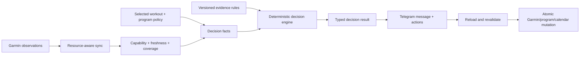

# GarminCoach Product and System Architecture

## Operator safety boundary (Phase 6A)

Operator health is read-only and has no product or coaching authority. Verified
SQLite backup is explicit and local; it makes no external calls. Restore remains
absent in Phase 6A, raw logs are never served by the web application, and an
existing malformed database fails closed rather than triggering automatic
quarantine, replacement, or recreation.

**Status:** Approved target architecture; current runtime differs where noted  
**Updated:** 2026-08-01

The detailed metric catalog and synchronization contract are defined in
[`METRIC_SYNC_POLICY.md`](METRIC_SYNC_POLICY.md). Formula semantics are defined
in [`METRICS.md`](METRICS.md).

Source execution structure (transition timers) is a
source-template/compiler concern only. It has no biometric, decision,
progression, coaching, or automatic scheduling authority, and changes only
future Garmin compilation after the existing confirmation boundary.

Source-duration review facts are pure local eligibility facts derived from one
active curated program, its reviewed policy duration, activation anchor, and
exact source-session identity. Durable review rows are reconciled through the
existing tenant-local scheduler/outbox path. The authenticated web card may
record continue, a planned deload/recovery week, or a seven-day reminder; these
are not biometric, AI, or calendar decisions and never change a cursor, planned
session, Garmin workout, program, or progression state. Telegram delivery is
outbox-only and independently deduplicated/revalidated.

## 1. Product contract

GarminCoach is a factual training assistant, not a simulated human coach or a
medical device.

1. Consequential decisions are deterministic and traceable.
2. An LLM cannot choose a workout outcome, reinterpret raw metrics, or execute a mutation.
3. Program rules and selected-session identity are evaluated before biometrics.
4. Metrics never silently rewrite exercises, sets, reps, or weights.
5. Telegram confirmation is required before a recovery-driven change.
6. The athlete may always retain the original selected workout.
7. Garmin is the normal source of completed sets, reps, weights, and available RPE/Feel.

## 2. Authority layers

| Layer | May do | Must not do |
| --- | --- | --- |
| Sync | Fetch and persist observations and provenance | Interpret physiology |
| Data quality | Classify support, freshness, validity, and history | Treat absence as unsupported |
| Program engine | Resolve selected session, cursor, and recovery spacing | Choose a different program session automatically |
| Evidence engine | Apply approved bounded rules | Invent weights, scores, or thresholds |
| Renderer/LLM | Explain a complete typed result | Change result or add actions |
| Action service | Apply a current confirmed action atomically | Execute stale or ambiguous confirmation |

## 3. When a decision runs

A recovery decision runs only when the athlete selected or scheduled a specific
normal workout in the website.

Without a selected workout, the app may show health and recovery data but does
not propose the next program session or create a Workout / Active Recovery /
Rest decision.

Selecting a workout evaluates fresh local data. It does not call Garmin. If
required data is stale or missing, Telegram may offer an explicit recovery
refresh.

## 4. V1 outcomes

- **Planned workout:** selected workout remains unchanged.
- **Active Recovery:** fixed 30-minute Garmin walking workout, duration only.
- **Rest:** no structured workout that day.

Active Recovery and Rest keep the original program session pending and do not
advance the program cursor. The canonical 30-minute Active Recovery walking
template is scheduled only after a current Telegram confirmation and exact
selected-session revalidation.

No response leaves the selected workout unchanged.

## 5. Biometric policy

### Direct authority

Fresh supported Garmin Training Readiness is the only biometric with direct V1
authority:

- Prime, High, Moderate: planned workout;
- Low: planned workout with warning;
- Poor: recommend Rest with explicit original-workout override.

Training Readiness components are not rescored.

### Unsupported or missing Training Readiness

GarminCoach does not create a replacement readiness score. Sleep, HRV Status,
Recovery Time, resting HR, stress, and Body Battery may create warnings and
context, but do not automatically choose Active Recovery or Rest in V1.

When a warning is shown, Telegram may expose athlete choices for the unchanged
workout, the fixed walk, or Rest. The selected outcome is stored separately
from the system recommendation.

### Data quality

Every decision observation records:

- capability scope and state;
- observed-for date/time;
- fetched-at and device-upload time;
- source endpoint;
- freshness state;
- validity/history coverage.

Capability must eventually be device/account/scale/activity scoped. Switching
watches must not reuse the old watch's unsupported state.

## 6. Telegram and mutation model

Telegram is the only recovery-action surface. The web app may display the
current result but has no recovery mutation buttons.

### Confirmed recovery choices

For a single current selected workout, GarminCoach offers one durable Telegram
choice set only for program-rest, Poor readiness, Low-readiness warning, and
no-biometric-authority outcomes: keep the original workout, replace the slot
with the fixed **Active Recovery — 30 Minute Walk**, or select Rest. Every
callback is claimed and revalidated against the exact decision and local
planned-session snapshot. The replacement uses the already verified walking
template and the source program session remains pending; neither a walk nor
Rest advances the program cursor. The same-slot flow never reads the private
calendar. Remote scheduling/unscheduling is compensated if local persistence
cannot commit. The dashboard remains read-only.

A pending interaction stores the exact target, source decision, program/sync/
calendar versions, expiry, and action payload. Button clicks reload all decisive
state. Stale actions fail closed.

Recovery actions are distinct from ordinary cancellation:

- accepting Rest or Active Recovery keeps the program session pending;
- accepting Active Recovery creates/updates and schedules the fixed walk;
- choosing the original workout is an override, not a rule change;
- no reason is requested;
- one override does not change future decisions.

## 7. Program sequence

The cursor advances only after a confidently matched completed activity:

1. exact Garmin workout provenance; or
2. a guarded unique exercise fingerprint for the next active-program session.

Unrelated or ambiguous activities do not advance the cursor. Missed or
recovery-replaced sessions remain next in sequence and do not become debt.

## 8. Sync architecture

### Usable initial bootstrap

First obtain today's recovery facts, seven wellness days, 30 activity days,
the latest ten strength activities, and current slow metrics. The app becomes
usable before background history completes.

### Background completion

Bounded resource-specific history fills wellness to 28 days, activities to 90
days, strength detail to the latest 20 activities/90 days, and body composition
when available.

### Morning recovery refresh

Fetch only device capability/upload, sleep, Training Readiness when applicable,
HRV Status, and Recovery Time. No activity history or slow metrics belong here.

### Incremental sync

Prefer combined/range responses, settle a small recent overlap, enrich only new
or incomplete activities, and recompute derived metrics locally.

### Weekly low-priority sync

Refresh current Fitness Age, VO2 max, capability-aware Training Status, body
composition, and bounded remaining gaps. Slow values are accumulated locally
only when they change.

### Rate limiting

A shared per-account guard prevents overlap. First 429 stops low-priority work
and persists cooldown. Ordinary page loads never call Garmin.

## 9. Metric surfaces

### Dashboard and weekly summary

Keep meaningful trends for sleep, HRV, resting HR, Recovery Time, Body Battery,
stress, steps, intensity minutes, workout quality, strength progress, VO2 max,
Fitness Age, capability-aware Training Status, and body composition when
available.

ACWR is descriptive UI data only.

### Optional AI context

The optional AI context is implemented as `ask-coach-v3`, under the
[`ASK_COACH_AGGREGATE_CONTEXT_CONTRACT.md`](ASK_COACH_AGGREGATE_CONTEXT_CONTRACT.md).
It sends compact aggregates, freshness, coverage, and decisive facts—not raw
sensor series, full history, GPS, or intraday timelines. It remains strictly
below the deterministic authority hierarchy and cannot alter a workout.

## 10. Current implementation gaps

The current runtime must later be changed to match this target:

- one global 90-day sync still drives unrelated resources;
- many daily-health endpoints are fetched separately per day;
- Training Status is fetched historically instead of capability-aware/current only;
- Fitness Age/VO2 max snapshotting is too frequent and scans history;
- priority sync fetches non-decision metrics;
- Training Readiness parsing assumes a dictionary although current upstream
  models expose timestamped snapshots;
- HRV Status and seven-day average are not stored;
- capability is keyed only by metric;
- activity enrichment is coupled to summary upsert;
- 429 handling retries too long inside historical loops;
- the current coach may propose the next session without prior website selection;
- current recovery walking is verbal-only rather than a confirmed replacement;
- current Rest behavior is not separated from ordinary cancellation.

These are roadmap items, not claims that Phase 1 documentation changed runtime behavior.

## 11. Evidence governance

Source progression is a deterministic local policy owned by exact source-tagged
`SessionExercise` rows. It has no biometric, AI, calendar, Garmin, or scheduler
authority; web confirmation changes only a future local template weight.

Every future prescriptive rule needs a versioned registry entry with population,
inputs, required history, freshness, output, exclusions, citation, evidence
grade, review date, and boundary/conflict tests.

No observational association may be promoted to a causal performance,
recovery, or injury-prevention claim.

## References

- [Metric and sync policy](METRIC_SYNC_POLICY.md)
- [Metric formulas](METRICS.md)
- [Routine source audit](routine_source_audit.md)
- [Garmin Training Readiness](https://www8.garmin.com/manuals/webhelp/GUID-A315BE5B-E191-4238-9712-D9C368997ADB/EN-GB/GUID-C21BE0C8-A08E-4DA1-B6C6-2E0E2DDDB372.html)
- [Garmin HRV Status](https://www8.garmin.com/manuals/webhelp/GUID-D3C2D1F9-D2C0-404D-9372-7B2D57459BF8/EN-US/GUID-9282196F-D969-404D-B678-F48A13D8D0CB.html)
- [vívoactive 5 Recovery Time](https://www8.garmin.com/manuals/webhelp/GUID-5D183A14-BB43-4A9B-B441-5F824214CE40/EN-US/GUID-DAC27D10-886A-4EA8-8339-674479E9574A.html)
- [Garmin Unified Training Status](https://support.garmin.com/en-US/?faq=EjPECQK58qA0xzJ5X74vm7)
- [ACWR critique](https://pubmed.ncbi.nlm.nih.gov/32502973/)
